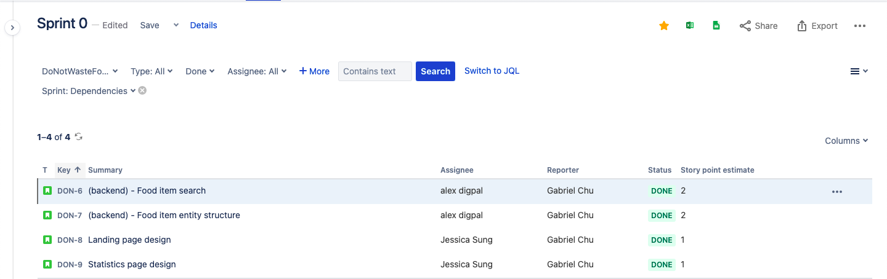
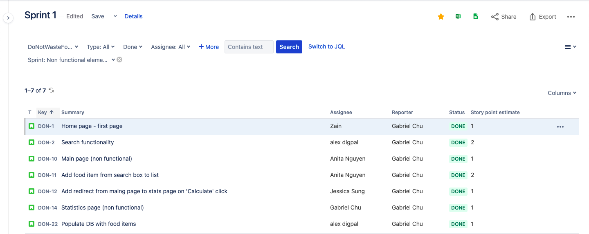
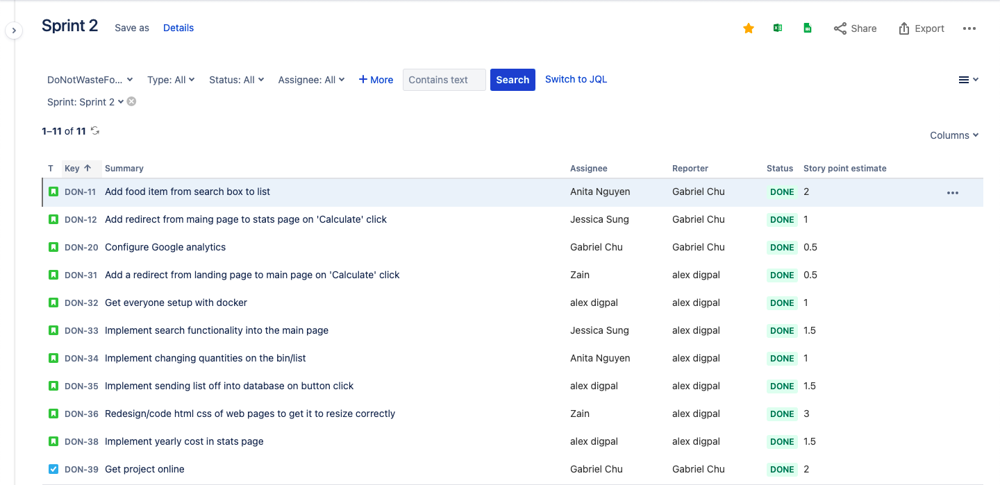
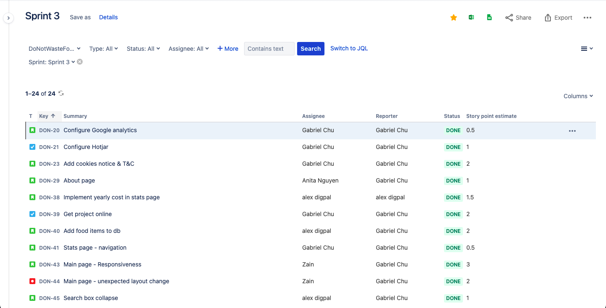
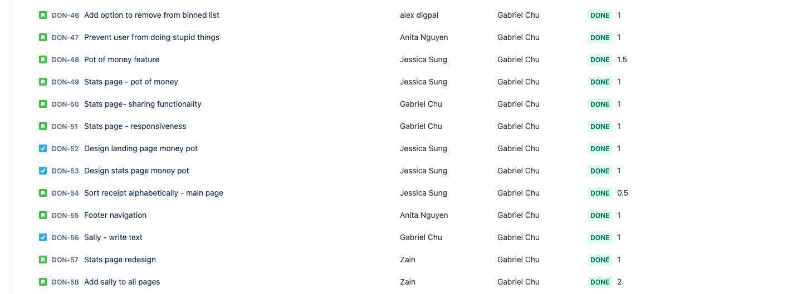

# Sprints and Project Management

A brief description of what this section is about.

## Table of Contents
- [The Team's Working Methods](#the-team's-working-methods)
- [Summary of Individual Contributions](#summary-of-individual-contributions)
- [Documentation of Sprints](#documentation-of-sprints)
- [The Team's Workflow](#the-team's-workflow)

## The Team's Working Methods
### Scrum

#### Rationale
We found Scrum to be the appropriate methodology to follow because it implements several key components and principles thath helped us during the development process:

1. User stories: it is key for an MVP to provide the product’s core value with the minimal amount of resources. User stories allowed us to focus on the value provided to users.
2. Defined roles: the allocation of defined roles allowed us to make decisions quicker. In particular, the role of product owner allowed us to swiftly decide what to build and the role of scrum master to keep things on track during sprints. was helpful because of the short period of time we had to work on the project.
3. Transparency: scrum encourages transparency in the communication of issues through the standup meetings. We are all new to web development so this was very useful in order to share knowledge among ourselves.
4. Sprints: as we developed the application, gathered feedback from users, and aligned the project with the brief we had to make frequent changes to the application. Scrum's sprint-based process was helpful to change priorities flexibly

#### Implementation

At the start of the week a sprint planning meeting would be held to discuss the product backlog with the whole group. It was the product owner's responsibility to create or add new items to the backlog by defining a set of user stories and ranking them in order of priority. We would then discuss among ourselves to assign story points to each story (each point was worth 2 hours) and reorganize the stories by breaking them apart or combining several. In this meeting it was decided what stories from the product backlog would be included in the next sprint and who would be assigned to it.

The backlog tasks were added to the task management software Jira, so everyone could access it and see what was: to be done, in progress and done. The sprint was then started the same day the plan was drafted with standup meetings happening every day/every other day (changing as appropriately decided in the scrum meetings) to discuss two things: **What was a member working on?**, **Are there any problems?**. These two questions enabled everyone to gain understanding on how the site was progressing and identified quickly if a task needed someone elses input/group discussion. 

The end of the week normally marked the end of the sprint where the scrum meeting that day would be an informal discussion of how the sprint had gone, if any tasks needed continuing in the next sprint, and vaguely looked at what should be done for the next sprint. A formal review was also conducted by the scrum master to analyse and put into action things discussed in the informal review to help with planning the next sprint.

As well as the scrum meetings, the team engaged in heavy pair programming throughout the development cycle which meant members were normally in constant communication with another member. Often there was someone working alone but Microsoft Teams was used throughout the day and daily to provide a communication channel to the rest of the group if needed.

## Summary of Individual Contributions
Each member acted as a full-stack developer with specialties in particular areas. 

**Alex Digpal-Race** was involved in: 
- Scrum master: lead the scrum ceremonies, reviewed how sprints had gone.
- Backend: created the server, models, food seeder and RESTful API used.
- Frontend: created the search service, models, and contributed to search component logic, main page logic, stats page logic.
- DevOps: integrated project with docker.

**Zain Kassam** :

**Anita Nguyen** was involved in various aspects of the project. These aspects includes:
- UX desgin: co-created and distributed surveys to better understand the target audience. Was involved in some design sessions and co-led initial ideation sessions. 
- Developer: worked on various aspects of the front-end (these aspects include 'About us' page, footer, and calculator page).

**Jessica Sung** specialized in UX design and front-end development. She led design sessions involving project ideation and the evolution of prototypes. As the lead designer, she iterated on the designs and created the designs of the MVP and high-fidentity product. She has guided the direction of the project from a reminder service for expiring foods to a food waste calculator based on user feedback and considered the elements of serious play. Her contributions ensured that the product was usable and valuable to end users. 

**Gabriel Chu** was involved in all parts of the project to different extents and adopting different roles:
- Project manager: he managed the project as a whole and contributed significantly to defining the problem to be solved. He made sure we were fulfilling the project's brief and going beyond it in certain areas. He kept things on track by setting our progress meetings' agendas.
- Product owner: he led the sprint planning sessions by prioritizing user stories and defining what the MVP should include. He maintained the product backlog and made sure user stories were value-focused. He worked with the lead designer to iterate over our designs.
- UX designer: he led some of the design thinking sessions. He co-created and distributed the surveys used to gain a better understanding of the problem and target audience. His participation in design meetings always aimed at maximizing usability and making sure the application transmits its value to users.
- Developer: he contributed to the frontend and hosted our application on AWS to share it with users.

## Rationale behind MVP

## Documentation of Sprints

### High-level overview

Criteria: we used 3 criteria to decide what to include in our first iteration of the MVP. 
  1. The lean methodology which promotes the identification and testing of the riskiest assumptions.
  2. A risk/difficulty assessment to focus our efforts on high risk assumptions that are relatively easy to test.
  3. Data from our user survey to focus our efforts on the assumption that is most likely to be true according to potential users.

We ranked our assumptions about the problem we are solving by order of risk and framed them as testable hypotheses. The first 2 hypotheses concerned our two main objectives, namely, raising awareness and motivating a change on behaviour. However, these are reliant on users being interested enough to engage with the application. Thus, we hypothesized three reasons (hypotheses 3 to 5) why they might engage and selected hypothesis 2 because according to our surveys, 33% of surveyees cared about food wastage due to the money lost associated with it. This was the largest group.

   1. We believe students at the University of Bristol will share the application with their friends because they think the application proposes a compelling case in favour of wasting less food.
   2. We believe students at the University of Bristol will reduce their food wastage after seeing how much they would have wasted in a year.
   3. We believe students at the University of Bristol will input their wasted food because they care about knowing how much money they are wasting.
   4. We believe students at the University of Bristol will input their wasted food because they care about knowing how much food they are wasting.
   5. We believe students at the University of Bristol will input their wasted food because they care about knowing how much pollution they are contribution with due to wasted food.

### Sprint 0: Working on dependencies
- Timeline: 30/03 - 04/04
- Goal: finish off dependencies and get used to the scrum methodology and Jira
- Main user stories completed: 
  - As a designer, I want to design the high fidelity landing page so that users understand the value of the application as quick as possible.
  - As a designer, I want to design the high fidelity main page so that users can search for items and add them to their list as easily as possible.
  - As a designer, I want to design the high fidelity statistics page so that users can absorb and process the value of the application as easily as possible.
  - As a backend engineer, I want to create the food item collection so that users can have a populated list of food items that the user can select from.
  - As a backend engineer, I want to create a bin collection for storing what foods users have binned.
  - As a frontend engineer, I want to create a service to communicate with the backend API to request and receive data.
  - As a backend engineer, I want to create a RESTful API to handle requests and responses from and to the frontend.

  
  Note: 1 story point = 2 hours

 

#### Summary of Sprint 0
This sprint was used as a starting point for the team to get used to the Scrum methodology. We identified the dependencies that needed to be completed before starting to build the application, tracked them with the help of Jira and finished them by the end of the week. The dependencies mainly had to do with increasing the fidelity of our previous wireframes in order to clarify and speed up the development in subsequent sprints. 

The basic shell of the website was also completed, with the site being made completely from scratch the frontend and backend were split into two different directories. The backend directory contained the server javascript file which consisted of both node and express methods to get a basic web server and API up and running, this was then tested using the Postman software to check expected requests/responses. Two mongoose model files were also added to mirror the design of the database collection (bin and fooditem) and a create-drop script was made for mongoose to load in (5) food items. The frontend directory was where a new angular project was generated, a search service was created using the angular http client for CRUD operation to work in tandem to the API. A search page component was also generated which consisted of a basic form element and button that a pre-existing food name could be entered into and a result displayed on the same page.

##### Review of Sprint 0
Sprint 0 was used to gain an understanding of the type of work flow, software management and web tools used in a web development project. The sprint exceeded expectation by yielding a basic fully working site the communicated data between itself (front - middle - back) and eliminated a lot of the grunt work involved in starting a project like this. The high fidelity design were also produced which would enable the group to have a physical standard to design the site to.

### Sprint 1: MVP's frontend

#### Plan

- Timeline: 07/04 - 14/04
- Goal: Create the MVP's frontend
- Rationale for user stories
  -  Most of the stories in this sprint are necessary for users to understand the application and be able to navigate and orient themselves in it.
  -  Going into sprint 1, high priority (must-have) features were selected from the design phase. More specifically, most of the stories in this sprint are necessary for
- Main user stories completed: 
   - As a user, when I navigate to the landing page I expect to see the title and subtitle so that I understand if the site is relevant for me.
   - As a user, I can click on the "Calculate" button in the landing page so that I can navigate to the page where I can track my food waste.
   - As a user, when I navigate to the main page I expect to see the search bar, my receipt of "binned" items, and a "calculate" button.
   - As a user, I want to search for a food item so that I can add it to my 'binned' list of tracked items.
   - As a user, I want to navigate to the stats page from the main page so that I can see the result of how much money I'm wasting due to food waste.
   - As a user, when I navigate to the stats page I expect to see the forecasted yearly amount of money wasted due to how much food I waste per week.
   - As a developer, I would like the frontend and backend linked so I dont have to keep loading both seperately.

  
  Note: 1 story point = 2 hours

 

#### Highlights

- Users are able to navigate through the entire app and understand what each page is about
- Search functionality implemented from the main page. The search component was nested within the main page component so that the two could communicate.

#### Summary of Sprint 1
Sprint 1 was where the design phase of the project ended and the implementation phase began. User story points were assigned to each story after having a quick group discussion. We knew these scores would vary in practice but they were used to get a rough sense of the complexity of the features and to help share the load evenly throughout the group. 

Pair programming for the sprint was favoured to accelerate learning and debugging, with 2 pods (with two members in each) starting/implementing the more complex features. The one-person pod was given a lesser scored feature to complete.

We already had a base site from sprint 0 however the backend and frontend, at this point, needed to be loaded/started seperately (nodemon for backend and ng serve for frontend), one of the advantages of express is its ability to connect them (through local ports), starting the backend server this way meant the frontend was also built from its dist files and therefore accessible locally. 

To start off with an easy initiation to the project, each pod was assigned a web page each of the site, an angular component was generated for each page, and the CSS style and HTML was coded to get the look of each page matching the MVP design.

The search component had been created from sprint 0 but wasn't currently accessible through any of the web pages, so the pod responsible for the main page added the search component as a child component to the main page and integrated it in so it was visible ontop of its parent component (main page).

It quickly became apparent that some of the team were encountering a problem with the create-drop fooditem script not working correctly with their local mongoDb, most likely due to connection between the web server and the mongo server. It was decided to start deploying the site using docker to have a clean reproducible environment for running the site, containers for both the node server and mongoDb were created in a docker compose script file in addition to a dockerfile that created the image using alpine linux as a base to copy over the site directory into (minus a few files). Getting the site to work with docker was time-consuming, luckily the pod responsible for creating the landing page finished early and so split up with one working on responsiveness for the landing page whilst the other could work on getting the site setup with docker. Near the end of the sprint, the docker setup was (partially) completed and would set-up all the connections automatically and seed the food items created in the create script if it detected there weren't any already in the db.

Doing so did mean the project was harder to test/visualise changes quickly as docker compose had to be built and run each time a change was made (which normally took around 1min). To get round this, for changes in the frontend ng build & serve were used to see the ‘shell’ of the web page quickly. 

#### Learnings from sprint 1
The aim for sprint 1 was to get the MVP design fully realised visually (without any functionality), which was done successfully. We overestimated (knowing a lot of people under-estimate) time for most of the tasks, although this was partly because we had already gotten a head start in the project from sprint 0. With the whole team now comfortable with the project structure and using Angular, Sprint 2 could involve more complex tasks involving functionality of the site and fine-tuning responsiveness for all pages. Docker was a nuiscance to get working and was an unplanned task but once it had been done most of the team saw its value of connecting everything automatically. The docker integration did bring with it more bugs that carried through and solved in Sprint 2. A key skill learned from sprint 1 was finding how to nest components and display them ontop of each other. From the design phase we had identified the search bar might have been needed on more than one page so having the ability to do this was a bonus.

### Sprint 2: Finish MVP's functionality
- Timeline: 13/04 - 20/04
- Goal: Add missing key functionality to the MVP and prepare for release
- Rationale for user stories
  - The second sprint served us to complete most of the key functionality for the MVP. 
  - We made sure it worked responsively in different devices because we were planning on releasing it to Bristol University students later on.
  - We also implemented a cookie banner and a privacy policy page since we were planning to release it online and we were going to use third-party apps to track behaviour.
  - Despite it not being essential, we took care of some usability details (i.e. scrollable lists) in order to discard a reason like poor usability when assessing why people went or did not go through the whole user flow.
- Main user stories completed:
   - As a user, when I click on a food item I've searched for I want it to be added to my "binned" receipt so that it gets tracked when calculating how much I'm wasting
   - As a user, I want to navigate back to the landing page once I've viewed the statistics page so that I can start the process again or have another user do it
   - These were 3 stories: As a user, when I navigate to the landing page, main, and stats pages from a mobile device, I want to continue understanding the application and be able to calculate how much money I'm wating yearly
   - As a user, when I get many results from a food item search, I want to be able to view them as a scrollable vertical list so that I can easily pick the one I am trying to find.
   - As a user, I want to add and subtract the number of items associated with a specific food item so that I match how much food I have wasted more accurately (plus and minus buttons)
   - As a user, when I navigate to the application, I want to have the option to deny cookies so that I have greater control of my private data
   - As a user, I want to know what is the applicaiton's privacy policy and what third-party applications are being used to track my data, so that I know that it is a trustworthy site

  
  Note: 1 story point = 2 hours

 

#### Highlights

- Almost all core functionality implemented
- Sending food item data from the frontend to be saved in the backend when clicking on the main page's "Calculate" button
- Made the application responsive
- Fixed Docker issues for achieving stable deployment on all team members systems
- Added Privacy policy and cookies banner

#### Summary of Sprint 2
Sprint 2 was where the functionality of the MVP was implemented, a user could search for a food item from the database but nothing would happened when it was clicked, similarly once a food item had been added to the 'binned' receipt based off of the design each food needed a plus and minus button to change the quantity. Clicking the calculate button needed to (as well as navigating to the stats page) send the 'binned' food items out to the database. Site responsiveness for all pages needed to be debugged to get the site working on many different displays (not just monitors). Some team members were having deployment issues with docker and not being able to access food items which also needed to be fixed.

Sprint 2 worked a lot like sprint 1 in the fact that the team pair programmed together, the first thing completed was the docker issue as it was effecting the teams ability to work. The problem was due to the fact the dockerfile copied the wait-for.sh into the docker image without changing its permission. This was fine when the docker file was run on a windows computer as the script copied in as executable automatically. However two of the linux systems the team used had the script as read only so it was copied in to the docker image like this.

Because all three of the user story features involved the main page component in some way a team of three (one team member assigned to each) worked as one 'pod' which involved one person streaming their system to the other two with everyone contributing. Although this may have created a small bottleneck, it meant there were no merge/conflicts on the main page and the work for all three was done quicker as there were three minds solving the tasks together.

Responsiveness of the site was assigned a high priority as the team wanted a whole range of devices, not just desktops/laptops to be able to use the site. This was because it was identified early in the user feedback that the site would be troublesome/unneeded effort to use constantly on big screen non-portable products, this would therefore make it more appropriate for portable devices that user's could use on-the-go. So whilst three members worked on the main page the other team members worked on the responsiveness of the two pages not being worked on (landing page and stats page). 

It was also identified half way through the sprint (15/04) that it would make sense to add some place holder data into the stats page so whoever coded the logic into the stats page in the next sprint wouldn't have to mess with the CSS or HTML, so this was also completed in sprint 2.

Some minor tasks to add a bit of polish to the site were also added, including a cookies notification on new entry to the site and a privacy policy added.

#### Review of Sprint 2
By the end of sprint 2, the whole site was nearing completion. The main page had all its functionality (searching, adding and editing food items) programmed into it with some buggy behaviour (total of food items not reflecting bin, removing food items when 0 quantity hit) which would need to be completed in sprint 3. Docker was now working on everyones machine and google analytics was integrated into the site. This meant sprint 3 could focus on minor things left to do like bug fixes, more responsiveness, getting the site hosted online and the last major task of displaying a yearly forecast in the stats page.

### Sprint 3: MVP release & Second Design Implementation
- Timeline: 19/04 - 02/05
- Goal: Finish off implentation of the First design
- Rationale for user stories:
  -  Finished all key functionality and started tracking using Google analytics because we released the app at the en of the first week of this 2-week sprint
  -  We added a few nice-to-have features like an About page and the ability to delete food items from the user's list because we thought this would enhance the app's clarity and usability respectively.
- Main user stories completed:
   - As a user, I want to visualise the yearly forecasted cost of the food I've 'binned' for the week so that I gain perspective on the implications of my food consumption habits
   - As a user, I want to delete food items from my "binned" receipt so that I am able to fix any mistakes
   - As a user, I want to navigate to "less important" pages in the application such as the "About Us" and "Privacy Policy" pages (footer)
   - As a user, I want to share the app via social media or by copying the site's link so that I can show it to my friends
   - As a user, I want to learn more about app so that I understand the application's purpose (about page)
   - As a user, I want to be able to access the application from any browser so that I need little effort to access it
   - As a user, if I waste more/less (yearly) than the average person I want to know by how much so that I get a better idea of how am I doing compared to the general UK population
   - As a product owner, I want to understand how people are using the application so that the team can prioritize features and user stories.
   - As a frontend engineer, I want to create a search service so that I can send data between unrelated components to calculate yearly cost in the stats page

  
  
  Note: 1 story point = 2 hours

 

#### Highlights
- Final key functionality such as calculating the forecasted yearly money wasted and comparing it with the average UK consumer was implemented
- Hosted the site on AWS EC2 to be able to share it with people easily
- Redesigned the application and added playful elements

#### Summary of Sprint 3
Going into sprint 3 the team we were going to have less time to dedicate to the website as other units were back on. With this in mind sprint 3 was given an initial duration of two weeks instead of one and the scrum meetings would move to every other day occurrence. It was planned that by the end of sprint 3 the release version of the site would be done, so any nice-to-have features that the team wanted needed implementing. An about page, site footer, alternative navigation, getting the site hosted online, populating the db with more food items, bug fixes for the bin, and calulating the yearly cost were all planned for the sprint.

Because the team was now well familiar with the workflow and processes of development, all of the tasks were completed by the the end of the first week. In hindsight, it would have been fine to have had sprint 3's duration as a week. Going into the second week of sprint 3 with the develop branch in an acceptable, stable state the site was pushed into the release branch. This was then used with AWS to host the website online and meant it could be sent out for user feedback. The second week of sprint 3, started by responding to feedback from the release to make the site more clear, playful and an overall better user experience. The site's colour scheme and some of its layout was redesigned and a new interactive entity named 'sally' was ideated. 

Sally was needed on all three (main, landing and stats) pages, because she did a different things on every page. This provided 3 new tasks to be completed as well as the redesign (colour change and some layout). All four tasks were completed by the end of the second week and had yielded the second design of the site in a releasable MVP state. The last thing done in sprint 3 was to pull the develop branchn into the release branch, so the online version had the latest release accessible to the public.

#### Review of Sprint 3
In hindsight sprint 3 could have been a week in duration and the second week could have been sprint 4. As mentioned above we didn't know how quickly we'd be able to work through the minor tasks so it made more sense to have a longer sprint. Sally was not made into a component as she performed a different task on each page, however it might have been worth creating as a component in a general way and add the specifics over her in each page. By the end of sprint 3 we had completed all the tasks we initially set out (with some variations from user feedback) to have in an MVP. The MVP can be thought of as in version 2.0 as the first design was version 1.0, from the design phase there were a load of features we ideated but prioritised them as extension features. 

### Review of All Sprints and Reflective Thoughts
Originally the team knew that projects like this were normally underestimated with regards to timing. We probably tried compensating too much for this and had room for more things to be done in each sprint. Because pair-programming was utilised it meant two or more team members were working on the same thing together, this bottlenecked the progress that could be made but was necessary for understanding, and it meant issues could be dealt with quicker and there were less conflicts with merging work. The backend bins collection was designed near the end of the design phase (so before any sprints), as the function of the site slowly evolved through feedback across the sprints the collection makes less sense as to why it is structured how it is. User logins were not implemented so the usrID property of the collection was not really used, the design also meant that (for the MVP site) the bins collection wasn't really used. With the weekly tracked waste of the user being sent straight to the stats page via a service and calculated on that page. The collection could have been redesigned to handle the bin entries in terms of weeks added, so the stats page could easily request a certain weeks entry more easily and thus elimating the need for the service and providing a use for the collection.

## The team's workflow
This is discussed in the system implementation.
