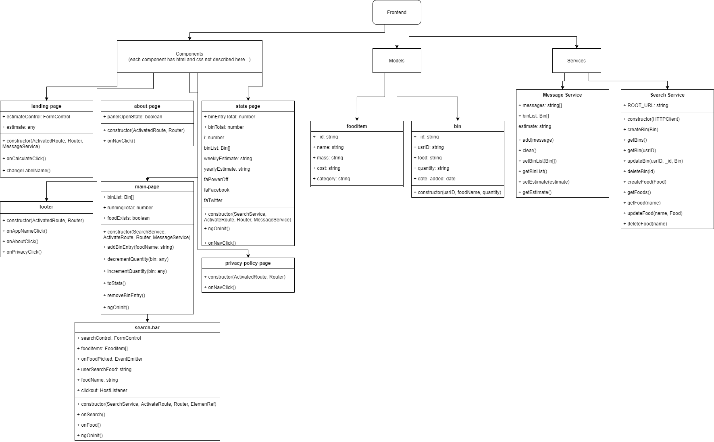
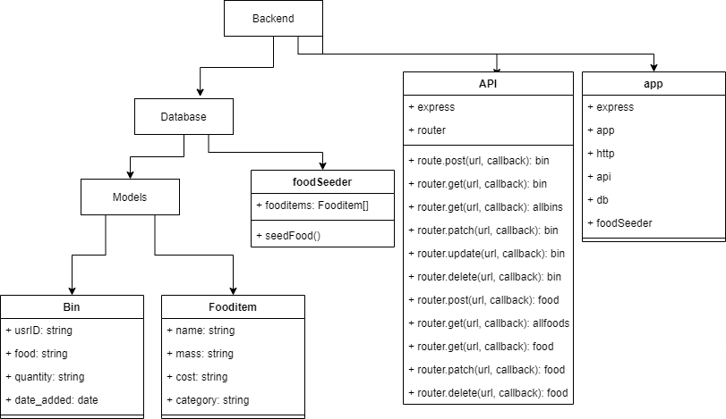
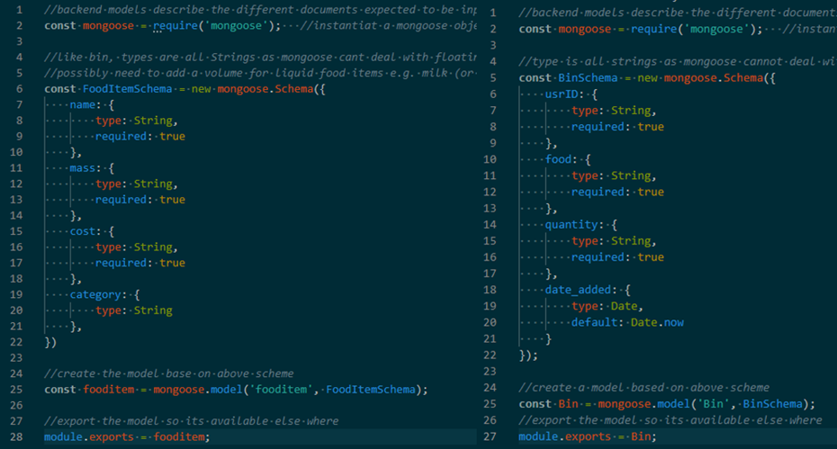
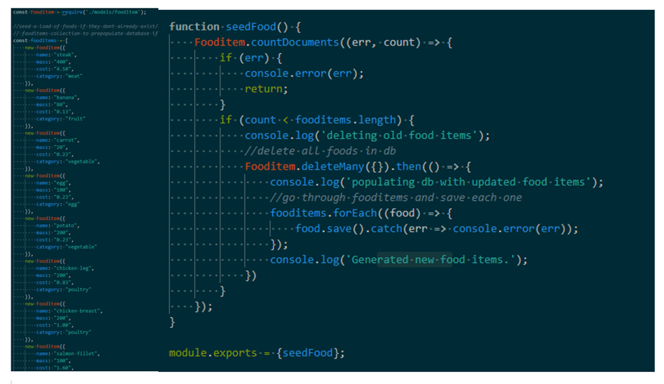
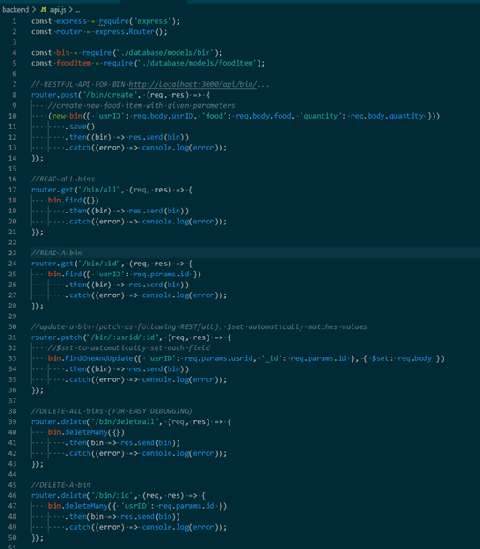

# System Implementation

A brief description of what this section is about.

## Table of Contents
- [Stack Architecture](#stack-architecture)
- [Back End](#back-end)
	- [MongoDB](#mongodb)
	- [Database Implementation](#database-implementation)
- [Middle Tier](#middle-tier)
	- [Express](#express)
	- [Node](#node)
	- [RESTful API](restful-api)
- [Front End](#front-end)
	- [Angular](#angular)
- [Deployment Details](#deployment-details)
	- [Implementation of Docker](#implementation-of-docker)

## Stack Architecture
The MEAN (MongoDB, Express, Angular, Node) stack was chosen to build and run the SPA website. The stack has several benefits to why it was chosen:
* Its widely used and so widely supported (one of the top three stacks for web dev)
* MEAN is written in one language, Javascript (/Typescript), across both server and client ends, so makes team work and co-ordination much simpler
* NoSQL database is a lot easier to design, run and use compared to SQL, also able to scale well both vertically and horizontally

The pictures below detail the finished class diagrams of the site, the diagrams show the main files used in each folder (not including the HTML or CSS for the components) and do not show some of the files that exist in the root project folder e.g. the db connection script, dockerfile. Also not shown are common Angular files/folders used in every Angular project e.g. the app-routing.module or app.component. It was decided on creation of the site, to help with understanding what files relate to which end (front or back) the frontend and backend would be split into two different folders. This caused issues down the line with integrating the project with docker and docker compose which is why some of the files e.g. the db connection script exist in the root folder and not one of the two folders (initially it made sense to have it in the backend directory).

## Back End

### MongoDB

MongoDB was the database host chosen for this website, its a noSQL db so it was quick and easy to design collections as we didn't have to consider normal form rules or defined relationships between the collections. It allowed the team to hit the ground running, as soon as we had got a high fidelity mock up, we could pull out relevant data that needed to be captured and saved into Mongo. The data model was fairly simplistic and only consisted of two collections.

* **Fooditems collection**: This was where all the food items a user could pick from (or create) were stored, it had four properties required for each document (food item) name, mass, cost, category (also mongoDB gave it a few automaticaly e.g. each one had a unique _id). It was debated whether the food item should have a volume property, and have it XOR'd with the mass property, so any liquid based food items could be easily quantified (not many people will know how much there milk weighs). From the start it was agreed to just have mass to keep it simple and that volume would be a nice to have feature to be added as a extension task.

* **Bins collection**: This was where any entries of food (wasted) the user had chosen to be tracked ended up, it also had four properties (as well as the default mongo ones) usrID, food, quantity, date_added. The food and quanitity added properties were the only ones adjustable to the user where as date_added was added by mongoDB based on the time it was added and the usrID was planned to be added by the site to distinguish entries in the bins collection by user. The end aim would have been to have a cloud based database where the user's food wasted entries would have been sent, which would have meant the documents in the collection needed to have an identifier of who had tracked (sent) that data. This was another nice-to-have feature (extension) that although planned for was never realised. Because user accounts weren't implemented and each user using the site would have had a local copy of the bins collection (so nother other user data would have been on it), the usrID = "1" was hardcoded for each new bin entry

### Database Implementation

Above is a picture of the data model design initially drawn up from reviewing the high fidelity design, as mentioned above, user accounts were planned for which would have meant saving information for each user however was never implemented. MongoDB was not used directly (no use of the mongo console used). The mongoose js library was used to easily implement the design above onto the website which extended the MEAN advantage of coding everything in javascript (/ts), two schema files matching the diagram above were coded and can be seen below.

All properties in the two schemas were selected to be String datatypes (with the Date datatype being a special string that mongoDB would add automatically on entry). This was because mongoose js does not allow floating point datatypes (even though mongoDB does) it was easier to parse the string data into ints or floats in the frontend typescript.

It would be important to note that the food property of the Bins collection is a foreign key which links it to the Fooditem property name (as seen in the data model). So for example if a user had chosen "carrot" as the 'food' property to be tracked, the site could link that to the unique fooditem with the name of "carrot" and so extract cost or mass for statistics or further manipulation. The 'usrID' property of the Bins collection was also planned to be the foreign key of the Users collection that was never implemented.

Connecting the database to the web server was done through docker, containers of both the web site and mongoDB were setup in the docker compose file. The connection string used to connect to the mongo db container was pulled in through a .env file which had the login info (left as default for ease when marking), this was another one of the files that had to be in the project root directory. The docker compose would first run the website, connect the relevant ports (3000 on the alpine image to 3000 on the local machine) then utilised a wait script to listen to the mongoDB port (27017), the mongodb image would then be started with the .env information and on success connect to the wait script, linking it to the web site. The site would then be started using nodemon in the alpine image and become accessible to the local machine.

A special food seeding file (which can be partially seen below or in backend/database/foodSeeder.js) was create for prepopulating the database with food items to pick from. Approaches to gaining this sort of data was discused in the design phase, with ideas like user-driven input or data scraping certain grocery sites to pull the needed information being suggested. It was quickly decided that for the MVP design a simpler method of prepopulating the food items ourselves would be most appropriate. This meant we could standardise metrics like cost and mass of food to maintain consistency for all users, data scraping sites would have led to inconsistencies between scanned in foods and would have led to many repeat entries that vary in a slight way and the quantity of food data received would have been unnecessarily large. User driven data was the idea more favourably discussed, which would have meant there would be a way (most likely a add button) for the user to add their own foods (or meals) to the database. This meant that if a user didn't agree with the standardised foods already on the database they could add their own and possible share it with others thus adding value to the other users and the web site. Again however, it was decided for the MVP release, the user only needed to select a standardised food only in the database and that user-driven input would be an extension task.

## Middle Tier

### Express

Part of the MEAN stack, express is a Node.js framework that makes building an API, to interact with the backend db, really easy. One of the first tasks done with express was to link the frontend (localhost:4200) being served by angular to the server (localhost:3000). It meant the team could use nodemon (detailed below) to continuously track changes to the website and made doing anything to the site much quicker. Building the API that the frontend interacted with was also made vastly simpler (compared to trying to do it without express), express has routing methods so whenever a request (get, post etc) was sent from the frontend, we could code a method to tell the backend exactly what data to retrieve from/send into the db using the mongoose models. The api was originally built into the server (app.js) file however CRUD methods for two collections in addition with code linking the angular dist files to the web server filled out the file too much so the API was given its own file and linked using the router module that comes with express as seen below. Because there were only two collections to be interacted with, the api was written in one large file instead of broken down into two different files (one for food items and one for bins). If user logins were to be completed, adding a third collection (or any more collections) it would make more sense to break them down into their own files and put them in a api directory.

### Node

Node was used to host the backend server, the server file in combination express connected the frontend and passed any relevant routes to the API file above. Before integration with docker, Nodemon was used in extension to Node to continuously serve any changes on the frontend which made the design/responsiveness phase of the site development much quicker and more intuitive.

### RESTful API

The API was built based on the RESTful design and implemented using express. There were only two collections of data we needed to interact with, CRUD (Create, Read, Update, Delete) methods were written for each with two read methods for each collection, to read all or read specific entries. It was decided all methods should be accessible to the user, especially for this build, as the user would only be affecting their local DB and not a shared one. Express handled what method should be triggered based on the request type and the URL and then the method would have a corresponding mongoose command which would be carried out, the response would then be sent back from the db and then send back to the frontend by the api.

## Front End

### Angular

Angular was first used to generate a component for each (main) web page (landing, main, stats pages for the MVP), with two pairs of the team doing the two complex web pages whilst the other member did a simpler one. HTML & Css only was done by the 3 pairs inititially as an easy introduction to Angular development. After the web pages were in a draft state the team (as detailed in sprint 1) split off into different tasks, some working on fine-tuning the responsiveness/layout and structure of the web pages whilst others focussed on coding the typescript to define the logic of each web page.

Half-way through sprint 1 (MVP) the team quickly discovered the power of angular components and nesting relevant components for easy data communication. For example the main page originally had the search bar coded into it, it was pointed out that in future releases the search bar may be needed else where in the site and copying from one page to another would be needlessly complex. Instead a component was created for the search bar and then nested into the main page as a child component. Nesting the component meant that data e.g. a food item being clicked on by the user could easily be outputted to the parent main page component using directives and the Event Emitter class but it also meant the whole search bar component could easily be put somewhere else if needed in the future.

Angular services were also used, a search service was created for interacting with the backend API to fetch the relevant data. CRUD methods were used for the API which were mirrored in the search service for sending appropriate data and receiving the JSON responses back and casting them to the appropriate frontend models. A message service was also created for instances where data needed to be communicated between components not nested e.g. the main page needed to send the stats page the bin entries so the stats page could calculate the yearly forecasted waste if the user kept wasting what they had just entered.

## Deployment Details
Following the guidelines atlassian recommends when it comes to continuous integration, the team split the github repo into several branches (main, develop, release). The main branch wasn't really touched it was originally planned to be the branch where stable and ready versions of the site would be pushed into at major milestones of the development cycle (e.g. implementation of MVP, implementation of first design etc), however in practice it ended up only being used for updating the report/portfolio. This was due to the fact that the site (after the major milestones) was normally streamed to our test users via software like Microsoft Teams to get feedback and so we didn't really need it to be in main (which is where we would have asked the TEST user's to clone from).

The develop branch was where most of the work happened and was the default branch, the workflow went something like:

* each feature was branched off of develop 
* the team programmed for the day then at the end of the day we pushed our changes back into develop as long as the specific feature branch was in an acceptable state

Because pair programming was utilised heavily at the start only two - three features were being worked on concurrently which meant the amount of conflicts there were from merging back into develop each day was limited and normally easy to sort.

Agile management software, Jira was used to help plan out the features. During the sprints the features being worked on would be moved to 'in-progress' status and when finished 'done' status which meant the team was notified often and minimised confusion (although for most of the sprints we were in meetings more or less every day and on calls with each other which would have also minimised any confusion that could have happened).

The release branch, similar to main, was used for saving the site when it was in an appropriate state for the general public. It was only created during the middle of sprint 3 when we had got the first design of the food wastage calculator site implemented. This was then hosted on the internet via AWS and could be sent out/visited to anyone as opposed to a select few of our test users. Because this branch was for 'release' states the branch was only pushed twice, once for the first design implementation and once for the second design implentation which is the most current version of the site.

Functional testing was favoured for the development of the site as it was quicker and easier for everyone to test their own changes to the site on an ad-hoc basis. Most changes made involved design and layout changes which would be hard to test in a code-based way. For this reason continuous deployment wasn't utilised in the project, with continuous integration being favoured as it had slightly less steps and is more suitable for a small amateur team of cs developers.

### Implementation of Docker

Docker was a way to get the same environment working across the whole team for development. Through github we could share the same code and run the site through node (& express) on each machine. However we quickly ran into several problems working this way, one of the team had seeded food items into the database locally and so only they could access these foods. This meant for the rest of the team, when it came to searching foods (one of the first tasks done) nothing happened (errors happened). Another problem was that some of the team were having trouble with mongoDB connecting with the web server. This was where docker came in to completely automate the setup and connections so we could load the site locally. The last step was to have the food seed automatically but only once, we didnt want to do a create drop script each time we ran the site, as it was still undecided whether the user should be able to add their own food or not. If we had let the user do this and the server was closed and started back up again, the users food would have been deleted.

(Further specifics can be found above in database implementation).

   
Next section: [Project Evaluation And Reflections](https://github.com/gabrielchuv/SE7/blob/develop/Portfolio/ProjectEvaluationAndReflections.md)
 
Go back to [README](https://github.com/gabrielchuv/SE7/blob/develop/README.md)
