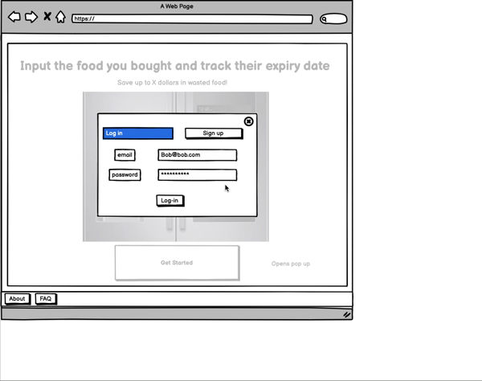
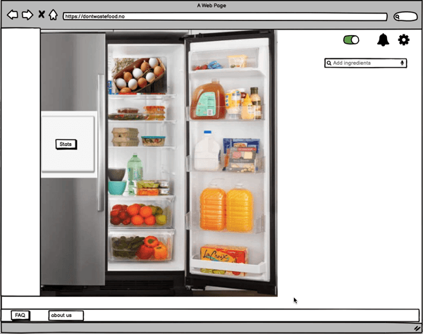

## Table of Contents
- [UX Approach](#ux-approach)
	- [Design Heuristics](#design-heuristics)
- [Design Timeline](#design-timeline)
- [Design Process](#design-process)
	- [Ideation and Concept Development](#ideation-and-concept-development)
	- [First Prototype](#first-prototyping)
	- [User Feedback: Wireframe Walkthrough](#user-feedback-wireframe-walkthrough)
	- [Second Prototype](#first-prototyping)

## UX Approach
We took a pragmatic approach to implementing the user experience by using elements from systems thinking, design thinking, and lean UX as necessary.
In this section we outline the rationale behind the choice of these paradigms and the elements that we borrowed from them. The actual implementation
is covered in the following sections.

* Systems thinking: given the broader socio-environmental issue that we are trying to tackle, we used systems thinking to narrow down the scope
  of our project and maximize our opportunity for impact. The implementation details are outlined in the Problem Scope section { link to section }

* Design thinking: this paradigm allowed us to put the user at the centre of every decision we made. The elements that we implemented were:
  * Problem definition:
  * User definition:
  * Ideation:
  * Wireframing:
  * Testing:

* Lean UX: we emphasized this approach to tighten our design feedback loop and move closer to a usable and valuable application faster
  * Assumptions:{outline initial assumptions (users, features, problem etc.) }
  * MVP

A word about user evaluation: user acceptance testing /evaluation of designs. Details will be provided in next sections

## Design Timeline

* This section will outline and focus on the iterative nature of our design development. Initial versions of user personas, wireframes etc. and how they
  evolved as we gathered more data and feedback. I would suggest doing it in chronological order.

* Ideation
  * All the divergent/convergent activities (outlined below)
  * Problem definition
  * Initial user persona
  * Prioritization of features
  * User flow creation
* Wireframing / early prototyping
  * Balsamiq wireframing according to user stories
  * Got feedback for first wireframe
    * Changed our problem assumption accordingly and modified wireframe
  * Got feedback from surveys
    * Changed our target audience assumption accordingly
  * Got feedback for second wireframe
  * Design heuristics and UX principles session
  * Prioritization of features for MVP
  * High fidelity design
  * -- NOT DONE YET -- Drive traffic and gather qualitative/quantitative feedback
  * -- NOT DONE YET -- Think of design/product future work

To do:
* Process survey data and re-define user persona
* Target this persona in next user feedback cycle

## Design Process
### Ideation & Concept Development
Design sessions were conducted to define the problem, develop the project idea and create wireframes to test with users.

Session 1: diverging ideas: each member brainstormed several ideas and those ideas were developed further as a group.

Session 2: converging ideas: the team voted on the top 4 ideas.

Session 3: design thinking: the team was led through a formal double-diamond design thinking session, divering and convering on various project ideas. The idea of a food waste tracker was chosen.

Session 4: brainstorming features: the team brainstormed features and prioritized them into three categories: core features, useful features, nice to have.

Session 5: user persona and wireframing: The target user and the user flow were defined. An outline of the wireframe was created with each page having a specific task.

Session 6: wireframing: the initial wireframe was completed.

Session 7: the wireframe was tested with users.

Session 8: evaluating feedback: key issues from the walk-through were discussed. The project idea shifted to a food waste calculated. A new wireframe was created.

#
### First Prototype: Reminder for Expiring Foods
After the initial ideation sessions, we started our first prototype. We wanted to create a website which help people track the expiration date of their food items. We had the assumption that the reason why people waste food is because it expires before they get the chance to eat them. With this in mind, we designed our prototype around the idea of a fridge, which we wanted to be a core component on our website to represent a person's actual fridge. On the website, the user can input all the food items that they have, and the website will estimate the expiration date of that item (the user have the option to change this if it is inaccurate). Once the user have input all their food items, the website will prompt the user when their food is about to expire. The user can decide how frequent they would like to be notified.

Furthermore, we designed our prototype in the perspective of the user, and thus, continuously asked ourselves "if I was a user, what steps would I take next..." This was important to us because we wanted the prototype to have a smooth user flow and that every step made sense.

1. **Landing page with login and sign up options. Users are required to have an account in order to get the full functionality of the website.**

  

2. **After login, a fridge pops up. If it is a new user, the fridge will be empty otherwise it will be filled with the user's ingredients. The fridge on the website represents the user's actual fridge.**

  

3. **The user can search for different food items and as the user types, a list of suggested foods will be visible for the user to select from.**

  

4. **If the desired food item is not available, the user can add the food item manually.**

  

5. **If the expiration date of any of the food items are incorrect, the user have the option to edit this manually.**

  

6. **The website has an in-app notification system. The user have the option to edit their notification preferences. We wanted to ensure that the user have access to notifications directly on our website, as well as, through email/social media.**

  

#
### User Feedback: Wireframe Walk-through
The wireframe for an application to remind users of expiring foods was evaluated with 5 users aged 18-30 who were interested in sustainability. During a virtual walk-through, users were asked to navigate each page to accomplish tasks including registering for an account, searching for items, editing expiration dates and setting notification preferences. Any difficulties were noted.

The session highlighted key issues in usability and informed the next iteration of the prototype. The issues were as follows:
1. **The platform as a web application did not align with user's routine of grocery shopping.** The prototype assumed users could input all grocery items and expirations dates after grocery shopping and check the platform for expiring foods. However, a user noted that he would prefer a mobile or smart fridge application than a web application for such tasks as that can be easily done while he is "on the go" or by the fridge.
2. **The burden of inputting and editing food items was greater than the benefit of reminders.** Users agreed that the process of inputting and editing items involved “too many clicks.” One user commented, “It’s going to be faster to go to my fridge and check expiration dates instead of going to my laptop and inputting all of the foods.”
3. **The application promoted awareness but was not actionable to change behavior.** A user admitted that reminders of expiring food is good to know but would not incentivise him to reduce food waste. Information regarding money lost would: “If it tells me, 'You wasted $25 bucks,' I’m like 'ugh' I wasted $25. The next time I go grocery shopping, instead of getting a gallon of milk, I’ll get half that and adjust my grocery buying. After months or weeks hopefully I'm closer to 0 wastage.” He suggested providing a metric of food wasted and tackling the causes themselves including poor planning and over-buying.

### Second Prototype: Food Waste Calculator
User feedback informed the second prototype which calculates cost accrued for food wasted per individual. To address issues (1) and (2), users will only have to input food wasted, which is not dependent on when they shop for groceries. Less information is required from users to produce the output: a calculation of money lost and environmental damage done by food wasted. To address (3), users are informed of the amount of food wasted in pounds along with a personalized goal (e.g, buy fewer groceries). Social norming and a personalized goal could nudge behavior change.

### User Feedback: Wireframe Walk-through
TODO

### First User Persona
With the aim of having a user-centred design process from the start, we created a hypothethical target user persona. Max is mainly characterized by caring about the environment and wanting to take action outside and inside his life to create a more sustainable world. Further details can be seen below:

#### User surveys
We subjected our assumptions for Max to test by surveying 36 students from various courses at the University of Bristol. The updated user persona was based on the results of the surveys and can be seen below.

Our approach
We selected questions that would allow us to test the different areas that we deeemed core to our user persona. More specifically, we aimed to gather data around the assumptions we had made about our users' goals, frustrations, demographics and food consumption habits. Additionally, we selected questions that would allows us to understand to what extend an individual user was experiencing the issue of wasting food.

Moreover, we approached the data analysis by first filtering the results by frequency of experiencing the problem of food wastage to narrow down the results to those who experienced the problem the most. These people are more likely to become early adopters and 50% of surveyees fit this criterion. This subset of people was further analyzed. Some of the questions were open-ended so we placed the data into categories (i.e. Hobbies: likes sports, likes arts etc.) to be able to summarize it. 

Insights

Most of the relevant results are reflected by the new user persona, however, an additional inisght was that half of surveyees (i.e. people who didn’t experience food going bad often) said that they “never” or "almost never" wasted food. Interestingly, a larger amount of people from this subset were already taking actions to prevent wastage compared to the group who had the problem more often. This would make the former group the right one to target if we were aiming to create a tool that allows people to take action on reducing food wastage. However, our tool’s main objective is to change people's behaviour (hopefully nudging them into behaving more like the former group) which reconfirms our decision to focus on the latter group of people who are not taking effective action to reduce their food wastage.

( ADD LINKS ) Our survey questions can be seen here and the raw data can be seen here.

### Second User Persona

