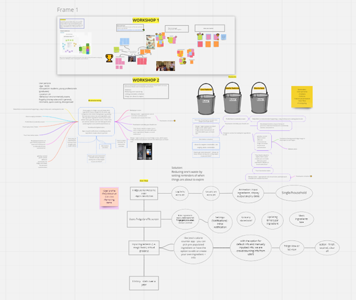

# System Implementation

A brief description of what this section is about.

## Table of Contents
- [Design Process](#design-process)
	- [Ideation and Concept Development](#ideation-and-concept-development)
	- [Early Prototyping](#early-prototyping)
- [The User](#the-user)
	- [Identification of Interacting Users](#identification-of-interacting-users)
	- [Understanding of User Group](#understanding-of-user-group)
	- [The Stakeholders](#the-stakeholders)
- [UX Approach](#ux-approach)
	- [Design Heuristics](#design-heuristics)
- [The Evolution of UI Wireframes](#the-evolution-of-ui-wireframes)

## Design Process
Brief introduction to how we approached this process.

### Ideation & Concept Development
**Problem statement:** Given the unsustainable amount of food waste, how might we help UK students and young professions (18-30s) be active in limiting their own food waste.
1. Diverging ideas meeting, brainstorming several ideas each and then building up on each idea as a group
2. Converging ideas meeting, narrows ideas down to top ~4 by voting
3. Miro meeting 1 - double diamond meeting, another diverging meeting going over ideas for the chosen idea of food waste tracking
4. Miro meeting 2 - brainstormed features, prioritised them and narrow them down
5. Miro meeting 3 - started balsmiq wireframing, started to create user persona, thought about user flow and what actions they can take on each page (UX)
6. Finish off balsmiq wireframing/prototyping
7. **next step** show prototype to users
8. Iterate on design based off user feedback

### Early Prototyping
Could include the powerpoint prototype

## The User

### Identification of Interacting Users

### Understanding of User Group
 questionnaires / user stories / interviews

### The Stakeholders

## UX Approach
Design heuristics/approach, design methods (design fiction / heuristics)

### Design Heuristics

## The Evolution of UI Wireframes
