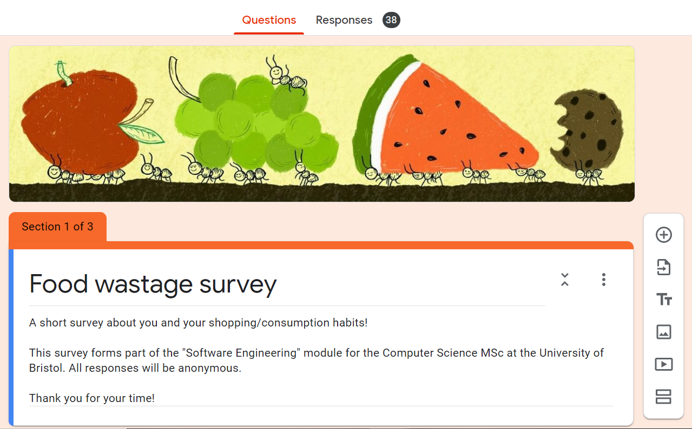
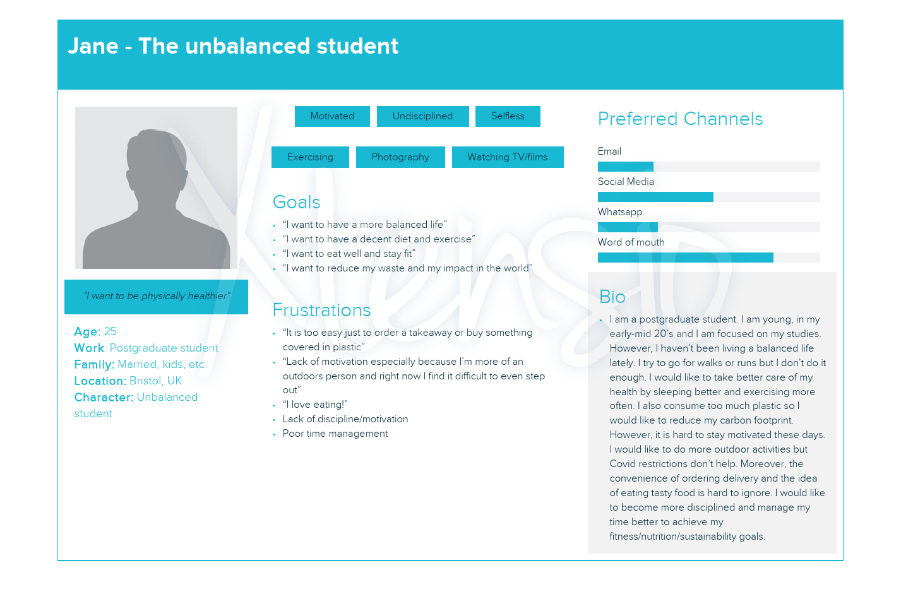

## Table of Contents
- [UX Approach](#ux-approach)
- [Design Timeline](#design-timeline)
	- [Design sessions](#design-sessions)
- [Design Process](#design-process)
	- [Stakeholders](#stakeholders)
	- [First User Persona](#first-user-persona)
	- [Second User Persona](#second-user-persona)
	- [First Prototype](#first-prototype-reminder-for-expiring-foods)
	- [Second Prototype](#second-prototype-food-waste-calculator)
	- [Third Prototype](#third-prototype-first-high-fidelity-design)
	- [Fourth Prototype](#fourth-prototype-second-high-fidelity-design)

## UX Approach

We took a pragmatic approach to designing a solution by using elements from systems thinking, design thinking, and Lean UX as necessary.
In this section we outline the rationale behind the choice of these paradigms and the elements that we borrowed from them. The actual implementation
is covered in the other sections.

* Systems thinking: given the broader socio-environmental issue that we are trying to tackle, we borrowed principles from systems thinking to explore the multidimensional causes and consequences of food wastage. This was useful to identify key leverage areas that we could reasonably tackle to maximize our impact on this issue. It took the form of a top-down analysis and breakdown of the problem of food wastage which is outlined in the Academic Review and Problem Definition sections within the [Background and Motivation](BackgroundAndMotivation.md) section.

* Design thinking: this paradigm allowed us to put the user at the centre of every decision we made. The elements that we implemented were:
  * Problem definition: early on in the project we made sure to define the problem that we were trying to solve (i.e. reducing food waste) to focus our ideation sessions.
  * User definition: early on in the project we created a user persona for the segment we are targeting. This helped us focus our ideas and design decisions on a particular persona which increases the probability of building something useful for this segment.
  * Ideation: we used divergent thinking techniques such as brainstorming and building upon other people's ideas. This is where our problem and user definitions came into play and proved to be useful to anchor our ideas.
  * Wireframing: after narrowing down our ideas we proceeded to wireframe our solution.
  * Testing: this element of design thinking overlaps with Lean UX which will be explained below.

* Lean UX: we embedded this approach into our design process by consistently testing or evaluating all of our core design outputs with the help of users or the project's brief to inform a next iteration. This is outlined in the Design Evaluation sections within the timeline below.
  * User persona: our first user persona was tested via a user survey and resulted in a second user persona.
  * First prototype: this prototype was tested via user interviews and resulted in the next prototype.
  * Second prototype: this prototype was tested via user interviews and resulted in the next prototype.
  * Third prototype: this prototype was evaluated against the brief's "serious play" requirement and resulted in the next prototype.
  * Fourth prototype: this prototype was evaluated against a set of design heuristics.

## Design Timeline

### Design Sessions

Session 1: diverging ideas: each member brainstormed several ideas and those ideas were developed further as a group.

Session 2: converging ideas: the team voted on the top 4 ideas.

Session 3: design thinking: the team was led through a formal double-diamond design thinking session, diverging and converging on various project ideas. The idea of a food waste tracker was chosen.

Session 4: brainstorming features: the team brainstormed features and prioritized them into three categories: core features, useful features, nice to have.

Session 5: user persona and wireframing: The target user and the user flow were defined. An outline of the wireframe was created with each page having a specific task.

Session 6: wireframing: the initial wireframe was completed.

Session 7: the wireframe was tested with users.

Session 8: evaluating feedback: key issues from the walk-through were discussed. The project idea shifted to a food waste calculated. A new wireframe was created.

Session 9: the wireframe was tested with users.

Session 10: evaluating feedback: notable feedback from the walk-through were discussed. The feedback validated the decision for a food waste calculator.

Session 11: designing MVP: the design for the first MVP with the core features were presented to the group for feedback. Design decisions were made based on usability heuristics. The MVP was approved to be developed in the first sprint.

Session 12: designing for high-fidelity: once the initial MVP was developed, the design was re-visited to add elements of play.

Session 13: designing for high-fidelity design: the high-fidelity design was presented to the group and approved to be developed in the next sprint.

## Design Process

### Stakeholders 
We defined our direct stakeholders to include university students and young professionals around the age of 18-30yrs. The reason they are our main stakeholders is due to the lifestyle of a young professional and university student. An assumption is that students under the age of 18 at school are less likely to be cooking their own meals and shopping for groceries. However, university students especially live a busy and stressful lifestyle which may lead to them focus less on household duties, wasting more food. Another assumption is that students may be likely to buy items at discounted prices/special offers which are close to expiry dates. Hence, their chance of wasting food is higher. Also, students may get take-away which may be wasted or cause other items they bought to go to waste. These are the main reasons this makes them stakeholders. Young professionals are likely to be busy and learning to cook and manage time. Hence their chance of food wastage is also high. With time management, it may lead to quicker meals being made which don’t use all ingredients or rely on takeaways, which could again lead to food wastage. 

We identified indirect stakeholders to include any individual in charge getting groceries, environmental groups and restaurant managers/owners. Though university students and young professions may have a higher likelihood to waste food compared to the average individual, any individual involved in buying/using groceries may benefit from an awareness of individual food waste. Knowing their contribution to food waste may, in theory, incentivize them to buy less foods or change cooking habits. Additionally, environmental groups may benefit from our awareness, particularly groups focused on food waste. Our application is a quick, single or multiple use tool to provide statistics on an individual's contribution to the problem. It may help push their agenda forward. Finally, though the application is targeted for households, its use is not limited. Restaurant businesses may benefit by learning how much money is lost or how much money can be saved if they found ways to reduce food waste. Reducing food waste, whether that is better planning for grocery shopping or spending less on certain ingredients, may not have been an option they had in mind for saving costs. Our application would have a dual benefit of brining awareness and providing an estimate of potential money that can be saved. 

### First User Persona
With our target stakeholder defined, we created a hypothetical target user persona. Max is mainly characterized by caring about the environment and wanting to take action outside and inside his life to create a more sustainable world. Further details can be seen below:

### Design evaluation: User surveys
We subjected our assumptions for Max to test by surveying 36 students from various courses at the University of Bristol. The updated user persona was based on the results of the surveys and can be seen below.

#### Our approach
We selected questions that would allow us to test the different areas that we deemed core to our user persona. More specifically, we aimed to gather data around the assumptions we had made about our users' goals, frustrations, demographics and food consumption habits. Additionally, we selected questions that would allows us to understand to what extent an individual user was experiencing the issue of wasting food. Questions included how often groceries were bought, how often they find food has gone bad, why it happened and how would they prevent this from happening. It was hoped that by gathering responses from this survey, we could tailor and target our SPA to the correct issues and impact to raise awareness. 

Moreover, we approached the data analysis by first filtering the results by frequency of experiencing the problem of food wastage to narrow down the results to those who experienced the problem the most. These people are more likely to become early adopters and 50% of surveyees fit this criterion. This subset of people was further analyzed. Some of the questions were open-ended so we placed the data into categories (i.e. Hobbies: likes sports, likes arts etc.) to be able to summarize it.

Though the survey was aimed at our target users (university students) it was skewed towards students at one university or just friends.  It would be more useful to collect responses at different universities, age groups and geographic areas to see if our assumptions are generalizable. 

#### Insights

Most of the relevant results are reflected by the new user persona, however, an additional insight was that half of surveyees (i.e. people who didn’t experience food going bad often) said that they “never” or "almost never" wasted food. Interestingly, a larger amount of people from this subset were already taking actions to prevent wastage compared to the group who had the problem more often. This would make the former group the right one to target if we were aiming to create a tool that allows people to take action on reducing food wastage. However, our tool’s main objective is to change people's behaviour (hopefully nudging them into behaving more like the former group) which reconfirms our decision to focus on the latter group of people who are not taking effective action to reduce their food wastage.

Our survey can be accessed [here](https://forms.gle/9Geo8f37rcHJN8de8).

### Second User Persona
Some of the key insights gained from the survey that helped us shape the new user persona were:

- 67% of respondents were female.
- 83% of respondents were between 18 and 30 years old.
- In their free time, 28% of respondents liked to exercise, 22% like to watch moves, and 17% liked to do artistic activities (i.e. photograph).
- 72% of surveyees had "health and wellbeing" as a lifestyle goal and 22% also had "supporting sustainability" as their goal.
- 44% of surveyees claimed that lack of motivaiton/discipline was not allowing them to fulfil their goals, 22% thought it was their poor time management.
- 61% of surveyees claimed the reason for their food going bad is because they forgot to eat it. 17% said they simply did not want to cook it.
- 33% of respondents stated that wating food bothers them because of the wasted money, 22% said it was because of environmental concerns.

The main limitation of this survey was that part of the data we were trying to obtain was qualitative so when processing the answers we had to allocate them into categories to be able to make sense of them. This may have introduced bias into the analysis, particularly because of the small number of respondents.

## First Prototype: Reminder for Expiring Foods
After the initial ideation sessions, we started our first prototype. We wanted to create a website which help people track the expiration date of their food items. We had the assumption that the reason why people waste food is because it expires before they get the chance to eat them. With this in mind, we designed our prototype around the idea of a fridge, which we wanted to be a core component on our website to represent a person's actual fridge. On the website, the user can input all the food items that they have, and the website will estimate the expiration date of that item (the user has the option to change this if it is inaccurate). Once the user has inputted all their food items, the website will prompt the user when their food is about to expire. The user can decide how frequent they would like to be notified.

Furthermore, we designed our prototype in the perspective of the user, and thus, continuously asked ourselves "if I was a user, what steps would I take next..." This was important to us because we wanted the prototype to have a smooth user flow and that every step made sense.

1. **Landing page with login and sign up options. Users are required to have an account in order to get the full functionality of the website.**

  

2. **After login, a fridge pops up. If it is a new user, the fridge will be empty otherwise it will be filled with the user's ingredients. The fridge on the website represents the user's actual fridge.**

  

3. **The user can search for different food items and as the user types, a list of suggested foods will be visible for the user to select from.**

  

4. **If the desired food item is not available, the user can add the food item manually.**

  

5. **If the expiration date of any of the food items are incorrect, the user has the option to edit this manually.**

  

6. **The website has an in-app notification system. The user has the option to edit their notification preferences. We wanted to ensure that the user has access to notifications directly on our website, as well as, through email/social media.**

  

### Design evaluation: User interviews

The wireframe for an application to remind users of expiring foods was evaluated with 5 users aged 18-30 who were interested in sustainability. During a virtual walk-through, users were asked to navigate each page to accomplish tasks including registering for an account, searching for items, editing expiration dates and setting notification preferences. Any difficulties were noted.

The session highlighted key issues in usability and informed the next iteration of the prototype. The issues were as follows:
1. **The platform as a web application did not align with user's routine of grocery shopping.** The prototype assumed users could input all grocery items and expirations dates after grocery shopping and check the platform for expiring foods. However, a user noted that he would prefer a mobile or smart fridge application than a web application for such tasks as that can be easily done while he is "on the go" or by the fridge.
2. **The burden of inputting and editing food items was greater than the benefit of reminders.** Users agreed that the process of inputting and editing items involved “too many clicks.” One user commented, “It’s going to be faster to go to my fridge and check expiration dates instead of going to my laptop and inputting all of the foods.”
3. **The application promoted awareness but did not incentivize for behavior change.** A user admitted that reminders of expiring food is good to know but would not incentivize him to reduce food waste. Information regarding money lost would: “If it tells me, 'You wasted $25 bucks,' I’m like 'ugh' I wasted $25. The next time I go grocery shopping, instead of getting a gallon of milk, I’ll get half that and adjust my grocery buying. After months or weeks hopefully I'm closer to 0 wastage.” He suggested providing a metric of food wasted and tackling the causes themselves including poor planning and over-buying.

User-interviews were very helpful in providing qualitative insights on the usability and viability of the project idea. Since the evaluation was "live," we saw how users interacted with the wireframe and what questions or barriers came up in real time. This helped us pin-point which features needed modification. However, this approach has limitations. Mainly, the interview environment is not like the environment where the user would ideally interact with the site. As test users were aware that they were being evaluated, this may also lead to bias in how they reacted or responded. Additionally, since the interview was administered via a virtual call, physical cues with added insight may not have been picked up.  

## Second Prototype: Food Waste Calculator
User feedback informed the second prototype which calculates cost accrued for food wasted per individual. The idea is that users will input the food wasted and receive a statistic of how much money they lost from food waste. This addresses issues (1) and (2) in that users will only have to input food waste, which is independent of when they shop for groceries. Assuming the food wasted is less than the food bought, less input is required by users for the system to work. From issue (3) we learned that users are sensitive to financial information. In response, the prototype brings awareness to not only the number of food items that went to waste but also the amount of money lost from food waste. A walk-through is as follows:

1. **Landing page with a one-off use of the calculator. This gives an idea of what the web application is about.**

  

2. **In order to get the full functionality of the web application, all users are required to have an account.**

  

3. **Once the user has logged in/created an account, they get some information about how the web application works. This is where they meet Jane, which is a character that follows them throughout the application. The calculator allows the user to enter as many food items as they need and generates a total for all food items.**

  

4. **Once the user has entered in all of their food items, they can navigate to the statistics page and view their results. A cost breakdown is included to help the user understand how much money they have wasted. In addition, the user can view the impact their waste have on the environment. Finally, a food breakdown is included to help the user better understand which food item they are wasting the most**

  

#
### Design evaluation: User Interviews
Users were again shown the updated/new wireframe prototype to see if the changes made were an improvement on the last version and to gleen more insight into improving the user experience of the site. A mix of four users, some from the last feedback session and some new to the site, aged 18-30 were asked to explore the wireframe telling the feedback practitioners, their opinion on what each page did, how effective it was at doing this, and what they would do next. The practitioners checked off the user story list tasks the user's were able to complete on their own and any tasks left at the end were then hinted at to see if the user could accomplish there task. The second wireframe walkthrough uncovered: 

#### Pro's
1. The **Jane the cow** feature was a nice 'gamified' way to measure and compare how well the user was doing in terms of waste.
2. The core concept of the site was clearer and all users said they were more likely to use and keep coming back to the site.
3. The statistical breakdown of the user's wastage was a great medium for visualizing progress to reduce waste and makes the site more impactful/actionable to the food wastage issue.

#### Con's
1. The naming of the statistics tab and page caused confusion as to what the tab pertained before going to it, so it might be worth it to rename it to something more clear.
2. The about and FAQ's could really be merged into one and the about can be a tab of the FAQ page.
3. Submitting food items on the user main page could be clearer.
4. The wireframe was designed for desktop view but users may interact with the site on different devices or layouts. During the walkthrough, one user viewed it on a mobile screen, which the wireframe was not designed for. 

## Third Prototype: Minimum Viable Product

After iterating on the wireframes, it was time to design and develop the minimum viable product. For the purposes of a minimally usable site, we decided to focus on the practical implementation of a food waste calculator. The focus was on 3 main pages: 

1. landing page where users are introduced to the objective of the site. 
2. search page where users are asked to search for spoiled foods and populate them in a list. 
3. results page where users are informed of how much money they are losing per year from food waste. 

We decided to separate each task into separate pages and include only the necessary information and features to complete the task. Thus, we removed the navigation tab which caused confusion in the wireframe walk-through and designed a system where users are guided to the next page via buttons. In response to the feedback on responsiveness, we developed the site to be compatible on major screen sizes. This site was deployed to share with users for evaluation via AWS. 

A live site, used for user evaluation, can be found here: http://18.219.146.56/.

### Design Evaluation: Play Revisited and a Call-for-Action 
Up until now, the focus has been on the serious problem and the prototypes were practical in nature. The design challenge was to embed elements of play throughout the interaction and create an enjoyable experience to a practical calculator application. 

A lengthy discussion was had. Some members suggested diverging the project idea to focus on carbon pollution and bring back Jane the Cow, which users spoke highly of. The character was humorous but this would involve redesigning and changing focus of the project with 3 weeks until deadline. Other members suggested an earlier idea of a “Black Mirror” storyline to introduce the problem and provide users two options per scene of how the storyline should play out. This idea was engaging but it was difficult to think of how to incorporate existing features (e.g., search engine for foods, food item list, calculated money lost from food waste) to the storyline. 

To make a decision, we referred back to user feedback. We asked, “Which issue was important? What kind of information mattered? What did users like or dislike?” It was clear that financial information regarding food waste and the character, Jane the Cow, were well received. We decided to keep our idea of a food waste calculator, keep the existing features we developed and introduce a similar character, Sally the Pot-of-Money. To add play to the interaction, we used Sally as a game mechanic to delight users. Instead of typing the estimate of money lost from food waste, users can click Sally (as she is moving by animation) to increase their estimate. We were able to stay focused on the scope of the project, introduce a humorous character and make the act of estimating a cost a clickable game. 

We purposefully framed the issue to promote behavior change. In terms of language and tone, the prototype applies internal reconciliation to bring awareness and help users internalize the issue to their own actions 1. For example, on the landing page, uses are asked, “Where has your money gone?” to convey the impact of money lost for them. Then on the search page, they are asked, “What foods have you wasted this week?” to convey their individual contribution to the issue. This approach was supported by research that showed that awareness of the issue on their own behavior is needed to nudge behavior change2, 3. To push towards action, we framed our call-to-action with social-norming. For example, on the results page, the reported cost of individual food waste is compared to the average cost of food waste per individual in the UK: “That’s more waste than that of the majority of people in the UK.” We chose social norming as research has shown that this approach may nudge individuals towards reducing waste4. Additionally, at a speaker event, Social Norms-Based Messaging: A Engine for Environmental Action by Author Robert Cialdini, attended by our UX designer, social norming has been a powerful motivator to reduce undesirable behavior. It follows the heuristic of “following the majority” and portrays a behavior as an outlier or not approved. 

To provide a quick action that users can respond to, a share option was included in the results page. As an application to bring awareness to the issue, this feature would further spread the word and start conversations around food waste around the user’s social network. 

### Design Evaluation: Web Analytics 
To start getting a better feel on engagement and other user preferences, we decided to track users’ engagement with our application via Google Analytics (GA). We shared the link to our application in various online course groups from the University of Bristol and asked people to check it out.

For tracking acquisition, we used Bitly to quickly and reliably track how many people entered the site. GA can be a bit unreliable and we wanted to maximize reliability due to the small number of users we were tracking. As you can see below, 39 users entered our application.

Moreover, the following engagement chart from Google Analytics shows that, on average, each user stayed around 45 seconds. It is possible for this data to be misleading (i.e. due to outliers) but as a first impression, it reveals a high likelihood that users are engaging with the application to some extent.

Finally, the following Tech Overview chart reveals that at least half of the people used browsers other than Chrome to interact with our application. This is important because we mainly designed our app thinking about Chrome and already a couple of the users of this prototype told us that it was looking odd from a safari desktop device. Unsurprisingly, another insight is that half of the users used mobile devices to enter our site.

One of the core goals of the application is to raise awareness and a considerable amount of users are needed for that. To reach that objective, at this stage, we also need to maximize the quantity of users that are capable of interacting with our app so that we can gather quantitative feedback from them and make our app more engaging. Therefore, we decided to use this last insight to justify the need to make our site as responsive as possible during our last sprint.

The main limitation of this quick quantitative research is the poor quality of the data obtained. Unfortunately, GA was built to track multiple-page applications and it requires a fair amount of tweaking to adjust it to an SPA. We decided to deprioritize this for the scope of this project, however, making sure we track how users navigate throughout our SPA components and interact with specific events such as adding food items, or sharing with their friends will help us make better decisions.

## Fourth Prototype: Second High-fidelity Design

With a functioning food waste calculator and a consensus on the playful interactions of the site, a high-fidelity prototype was designed. This included all of the search and calculate features in the MVP. The calculator itself was made playful by gamifying its use. The tone of the site changed from “input food items went to waste and see how much money you lost from food waste” to “guess how much you loss from food waste and see how much you’re actually losing.” The high-fidelity design incorporated the playful elements within the core of the application and emphasized the objective to bring awareness by featuring a sharing option. 

A live site for the high-fidelity prototype can be found here: http://13.59.46.105/home.

### Design Evaluation: Design Heuristics
THe final prototype was evaluated against common usability heuristics. This was adapted from https://www.nngroup.com/articles/ten-usability-heuristics/.

**1. Visibility of the system**

The objective of the application is to increase awareness of individual food waste. To do so, the system guided users through the following steps:

Users guess how much money they are losing from food waste  
↓  
Users input the amount of food went to waste that week  
↓  
The system calculates their money lost from food waste per year  

To ensure all steps are completed in order and to prevent skipping of steps, users are navigated to the next step by a button at the bottom of the page. There is no option to skip steps and users are alerted if a step is incomplete (e.g., no input for estimate of food wasted). To set expectations, buttons are clearly labeled with the objective of the next page and instructions for each page are bolded as headers.

**2. Reliability to the Real World**

With the theme around food waste and money lost, the design of the application includes recognizable icons related to the theme. For example, the search page perfectly exemplifies the two themes of food waste and money. The search term function is positioned above an icon of a waste bin to emphasize that the food searched were the foods that went to waste. On the same page, the list of food items added are displayed on a receipt format as receipts typically hold information of items and quantity of items. The template itself was off of a real grocery store receipt.

**3. User control**

The group discussed whether to add a function to remove items from the list once they are added. Some argued that the item to remove can remain on the list but be set to 0. Others argued that the system will automatically remove the item once it is set to 0 quantity. To provide users more control in the case that an item was added by mistake or an item is to be removed, an additional ‘x’ icon was added next to the food name. A simple click on the icon will remove the item.

**4. Error prevention**

As the system requires users to complete tasks in-order, extra thought was given to guide users through each step. To do so, a pot-of-money character, Sally, is introduced. From the landing page to the results page, Sally provides instructions and feedback on her thought bubble. As well as providing useful information, Sally becomes a familiar character throughout the application.

As inputting the food items wasted involves the most feedback from users, several error-prevention features were added. For example, the search box is validated on alphanumeric inputs and items selected are marked with bolder colors on hover. The items added are immediately displayed as a list for validation.

**5. Minimalistic design**

To minimize the amount of information on one page, each task (e.g., introduction of the application, input of food items, output of the cost of food wasted)  was given its own page.

Based on user feedback, the design of each page was mindful of the number of clicks required from users. Initially, the design relied on pop-up overlays, for example, to search for an item and to adjust its quantity with a drop-down. The overlays were removed in favor of simple icons like the plus and minus icons to adjust quantities of one or more items.
   
Next section: [Sprints and Project Management](https://github.com/gabrielchuv/SE7/blob/develop/Portfolio/SprintsAndProjectManagement.md)  
Go back to [README](https://github.com/gabrielchuv/SE7/blob/develop/README.md)

## Bibliography 

1. Applying Behaviour Change Methods to Food Waste. (2020). In Routledge Handbook of Food Waste (pp. 293–310). Routledge. https://doi.org/10.4324/9780429462795-23
2. Bamberg, S., & Moser, G. (n.d.). Twenty years after Hines, Hungerford, and Tomera: A new meta-analysis of psycho-social determinants of pro-environmental behaviour—ScienceDirect. Retrieved April 26, 2021, from https://www.sciencedirect.com/science/article/abs/pii/S0272494406000909
3. Klöckner, C., & Blöbaum, A. (2010). A comprehensive action determination model—Toward a broader understanding of ecological behaviour using the example of travel mode choice. 574-586. https://doi.org/10.1016/j.jenvp.2010.03.001
4. Quantified consumer insights on food waste | REFRESH. (n.d.). Retrieved April 26, 2021, from https://eu-refresh.org/quantified-consumer-insights-food-waste

## Credits 
The icons used in the design and application were courtesy of canva.com and giffy.com.
