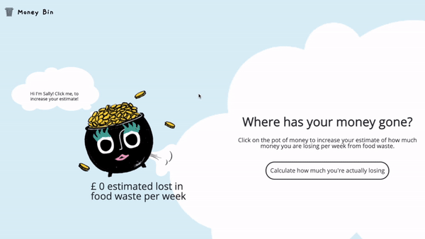
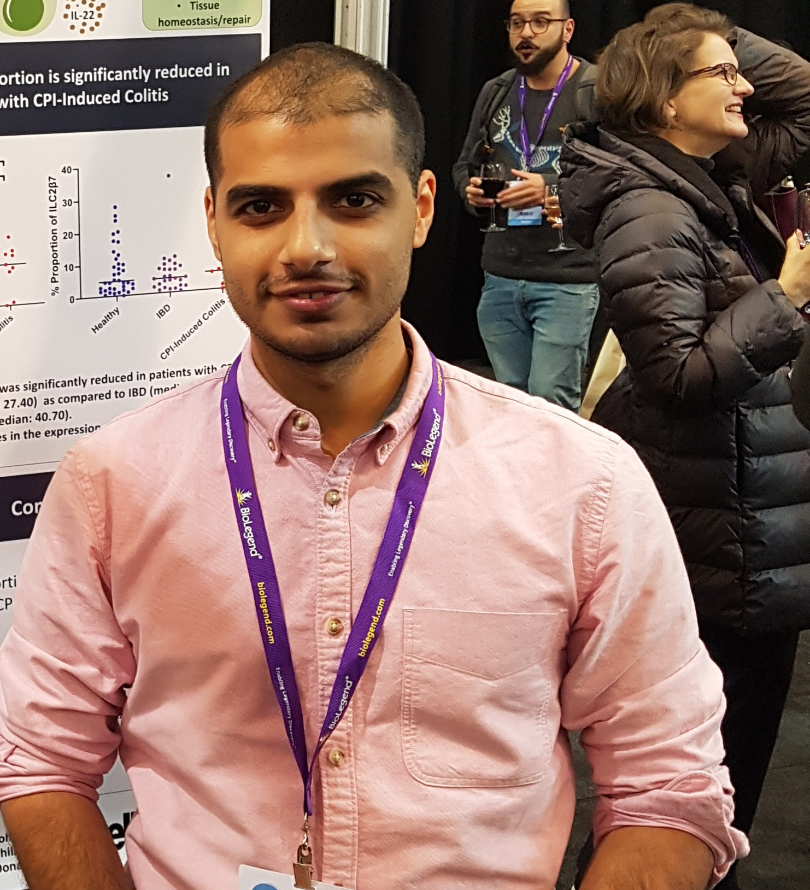

<p align="center"></p>
<h2 align="center" style="font-size: 30px"><b> A food waste calculator </h2></p>
<p align="center"></p>
<p align="center">
<a style="font-size: 20px" href="https://youtu.be/QPAQZRCcuss" target="_blank">Watch our trailer here</a>
</p>


## Abstract

According to the Food and Agriculture Organization of the United Nations, the total financial, environmental, and social cost of food waste and loss stands at 2.6 trillion dollars annually. This is associated with 3.3 billion tonnes of CO2 annually and enough food to the 690 million undernourished people in the world at least twice. In the UK, as in most developed countries, waste concentrates at the retail and consumer levels. Moreover, 70% of this waste is generated by households. Due to these two reasons, our proximity to UK end-consumers (i.e. students), and most online tools being focused on retail businesses, we have decided to centre our attention on households. More specifically, we will focus on motivating UK students to waste less food. The application developed encourages students to waste less food by putting the issue into a longer-term and more personally-relevant perspective. Namely, after inputting how much food they have wasted in a week, they are presented with how much money they would waste in a year. To achieve this, we designed and built a single-page application using the MEAN stack. This consists of a noSQL type database which facilitates design and integration, the Angular framework, which allows developers to build the site in components that get rendered dynamically by the browser, and Express and Node which are used used to host the web server and API, allowing communication between the users’ browser and the backend database.

<br>
<br>

## Project Objectives

Having identified a worthwhile problem to focus on (i.e. the reduction of food waste among UK students) we defined the high-level objectives we followed throughout our project:

1. Design and build a single-page application to raise awareness about food waste and motivate UK students to waste less food
2. Design and build a differentiated solution that is convenient to use and accurate when providing a forecast of yearly wasted money due to food waste
3. Design and build a solution that incorporates playful elements
4. Design and build a user-centered solution


### Success checklist
We created a set of sub-goals that indicate the extent to which we have progressed towards our high-level objectives.They are ordered from short-term to long-term and from less ambitious to more ambitious ones. Some of the latter goals within each objective are meant to surpass the duration of the current project and serve to outline the general direction the project would take across these different objectives. Some of these points are elaborated in the “Future Work” section.

The points in green are the ones tackled to some extent by our current project and the ones in red are longer-term goals.

- Raising awareness about food waste and motivating a change in behaviour
  ```diff
  + Our user persona expresses interest in the application via user interviews. 
  + Users engage with our application.
  - 20% of new users complete the application’s user flow from start (i.e. landing page) to finish (i.e. statistics page)
  - After completing the user flow, 20% of users engage by sharing the application with their friends.
  - Conduct user interviews with the same set of people before and after using our application to gauge if it has had any impact on their food consumption habits. Is the difference in waste statistically significant?
- Designing and building a differentiated solution (convenience and accuracy)
  ```diff
  + Testing our designs with potential users frequently to optimize for usability.
  + Asking people to fill in how much they think they’ve wasted only this week.
  + Not asking users to fill in hard to get information like specific food weights.
  + Considering the quantity of food items and their cost when calculating the forecasted yearly value
  - Utilize an API to extract current costs of food items from a supermarket
  - Implement greater diversity of items and various quantity measurements per food item
  - An image recognition algorithm that can recognize what kind of food and how much you’re wasting from a picture you take before throwing it away
- Designing and building a playful application
  ```diff
  + Incorporate elements of play and/or interactivity with the purpose of making the application more engaging.
- Designing and building a user-centered application
  ```diff
  + Defining who our target persona will be and designing the application with them in mind.
  + Testing our designs with potential users frequently to optimize for usability.
  - Conduct qualitative and quantitative user research with users outside of the team’s network to reduce bias 
  - Conduct thorough quantitative user research via web analytics to spot usability issues and achieve virality

## Getting started
**Note:**
.env file was left as default (from workshops)

**Requried programs:** `docker`

### **How to run:** <br>
1. Clone or fork this repository
2. Navigate to SE7 project folder
3. Add a .env file
4. Run `docker compose up --build`
5. Go to [http://localhost:3000](http://localhost:3000) to view the site

<br>

### **Alternatively view online at:** [http://13.59.46.105/](http://13.59.46.105/)

<br>
<br>

## Team

| The Team    |             | Role        |
| :---------: | ----------- | ----------- |
| | [Alex Digpal-Race](https://github.com/alexDigpalRace) : <cr20208@bristol.ac.uk>| Scrum Master, Full stack |
| |[Zain Kassam](https://github.com/Zainzzkk) : <dw20513@bristol.ac.uk>| Front-end developer, Responsiveness |
|      |[Anita Nguyen](https://github.com/ng0c) : <wl20794@bristol.ac.uk>| Front-end developer, UX Designer |
|      |[Jessica Sung](https://github.com/jessicaksung) : <zu20706@bristol.ac.uk>| Front-end developer, UX Designer |
|      |[Gabriel Chu Valdez](https://github.com/gabrielchuv) : <gabriel.chu.2020@bristol.ac.uk>| Project manager, product owner |

<br>
<br>

## Project Sections

### 1. [Background & Motivation](Portfolio/BackgroundAndMotivation.md)
* Industry Review - market analysis
* Academic Review - problem definition

### 2. [UX Design](Portfolio/UXDesign.md)
* UX Approach
* Timeline
* Process - user personas, wireframe evolution, prototypes

### 3. [Sprints & Project Management](Portfolio/SprintsAndProjectManagement.md)
* Working Methods
* Individual Contributions
* Overview of Sprints - timeline, highlights

### 4. [System Implementation](Portfolio/SystemImplementation.md)
* Stack Architecture
* Back End - MongoDB
* Middle Tier - Express, Node, RESTful API
* Front End - Angular
* Deployment - Docker

### 5. [Project Evaluation And Reflections](Portfolio/ProjectEvaluationAndReflections.md)
* Reflective Discussion on the Success of the Project
* Reflection on Working Practices of the Team
* Reflection on The Impact of COVID-19
* Discussion of Future Works
* Social and Ethical Implications
