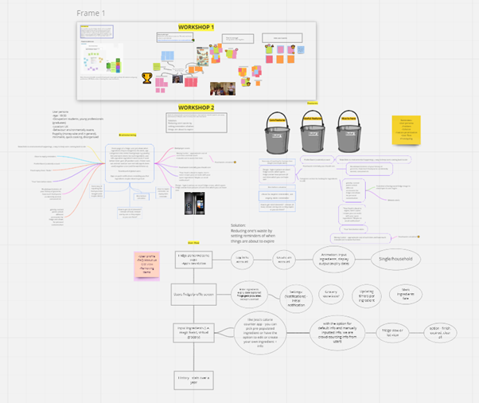

# **dontwastefood.no**

1. This website is a tool for tracking and reducing household food waste. The website notifies/alerts (via selected medium ... email, website alerts, social alerts) when food is about to expire. The site acts as a hub page to track all food items you currently have, visualised by a fun, interactive fridge, you'll gain points for foods you use before the expiry timer hits **0**, if your dumb enough to let it hit 0 you'll be docked points and food waste santa will add you to the naughty list.

# **Group Members**
1. Alex OG Digpal-Race (cr20208@bristol.ac.uk)
2. Zain
3. Anita Nguyen
4. Jessica Sung
5. Habriel Englaisais

# Ideation & Concept Development
**Problem statement:** Given the unsustainable amount of food waste, how might we help UK students and young professions (18-30s) be active in limiting their own food waste.
1. diverging ideas meeting, brainstorming several ideas each and then building up on each idea as a group
2. converging ideas meeting, narrows ideas down to top ~4 by voting
3. Miro meeting 1 - double diamond meeting, another diverging meeting going over ideas for the chosen idea of food waste tracking
4. Miro meeting 2 - brainstormed features, prioritised them and narrow them down
5. Miro meeting 3 - started balsmiq wireframing, started to create user persona, thought about user flow and what actions they can take on each page (UX)
6. finish off balsmiq wireframing/prototyping
7. **next step** show prototype to users
8. iterate on design based off user feedback

#
